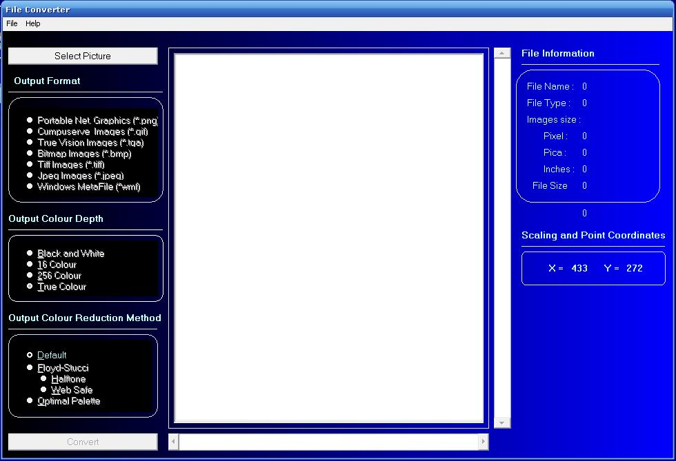



## Picture Converter

### Description

Convert Picture to output format... portable net.graphics, compuserve, true vision image, bitmap image, tiff image, jpeg image, windows metafile, vice versa.... output color depth, black and white, 16 colors, 256 and true colors,.... output color reduction method ... default, floyd-stucci (halftone - web safe) and optimal palette
 
### More Info
 

             |
---                |---
**Submitted On**   |2007-05-29 10:07:54
**By**             |[Gerbert Pagtama](https://github.com/Planet-Source-Code/PSCIndex/blob/master/ByAuthor/gerbert-pagtama.md)
**Level**          |Intermediate
**User Rating**    |4.8 (57 globes from 12 users)
**Compatibility**  |VB 3\.0, VB 4\.0 \(16\-bit\), VB 4\.0 \(32\-bit\), VB 5\.0, VB 6\.0
**Category**       |[Graphics](https://github.com/Planet-Source-Code/PSCIndex/blob/master/ByCategory/graphics__1-46.md)
**World**          |[Visual Basic](https://github.com/Planet-Source-Code/PSCIndex/blob/master/ByWorld/visual-basic.md)
**Archive File**   |[Picture\_Co2068165302007\.zip](https://github.com/Planet-Source-Code/gerbert-pagtama-picture-converter__1-68707/archive/master.zip)

